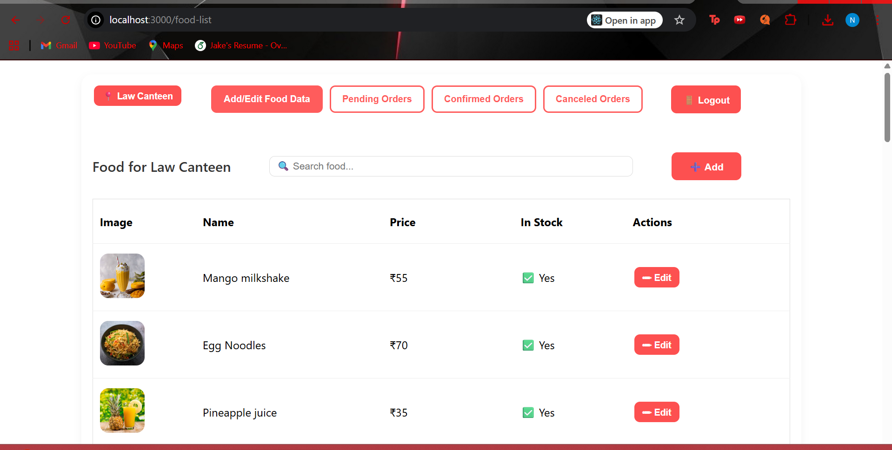
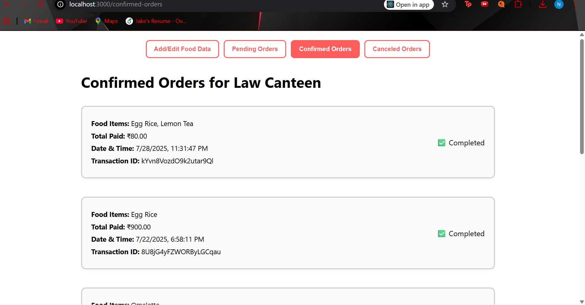

# 🍴 BMS Canteen Admin Website

An admin management dashboard for the BMS Canteen app.  
Built to handle **menu updates, stock management, and order monitoring** in real-time.

---

## 🚀 Features

- 📊 **Dashboard View**: Overview of orders, stock, and sales.  
- 📝 **Menu Management**: Add, update, or remove food items easily.  
- 📦 **Stock Control**: Toggle availability of items in real-time.  
- 👥 **User Orders Monitoring**: Track live customer orders and statuses.  
- 🔐 **Secure Login**: Restricted admin access only.  

---

## 🛠️ Tech Stack

- **Frontend**: React.js  
- **Backend**: Node.js + Express  
- **Database**: Firebase / Firestore  
 

---

## 📸 Screenshots

### Dashboard View


### Orders



---

## ⚙️ Installation

1. **Clone the repo:**
   ```bash
   git clone https://github.com/your-username/bms-canteen-admin.git
   cd bms-canteen-admin
   ```

2. **Install dependencies:**
   ```bash
   npm install
   ```

3. **Set up environment variables:**
   - Add Firebase config details in `.env`

4. **Run the development server:**
   ```bash
   npm start
   ```

> The app will run at `http://localhost:3000`

---

## 🚀 Deployment

1. Push code to GitHub.  
2. Connect the repo to **Vercel** or **Firebase Hosting**.  
3. Add `.env` variables in the hosting provider settings.  
4. Deploy 🎉  

---

## 👨‍💻 Author

Developed by **Nihal Manjunath**  
For managing the **BMS Canteen Application** efficiently.

